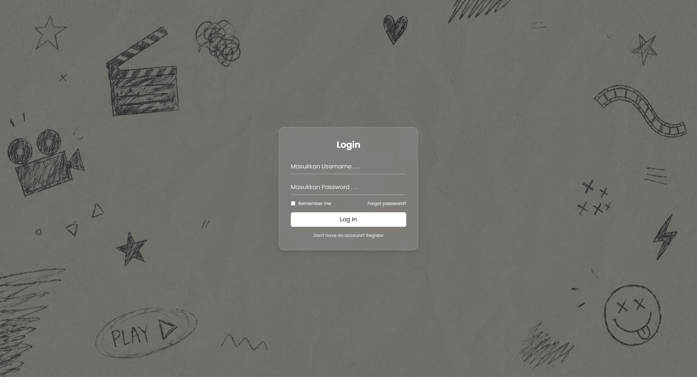
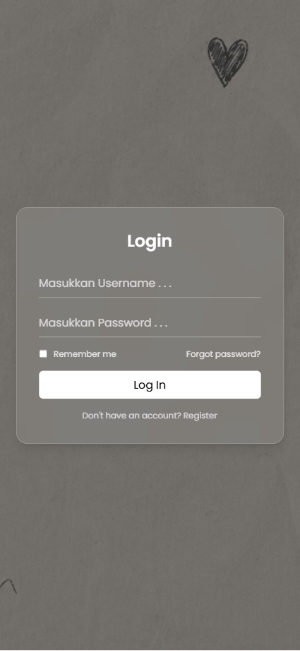
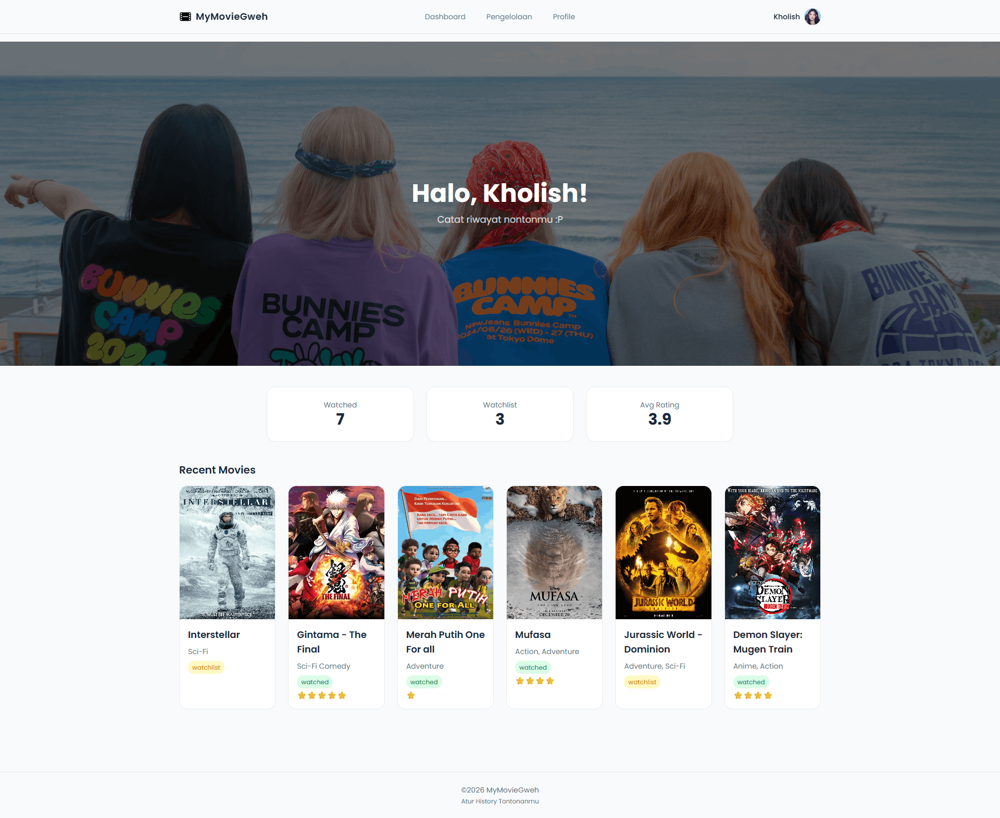
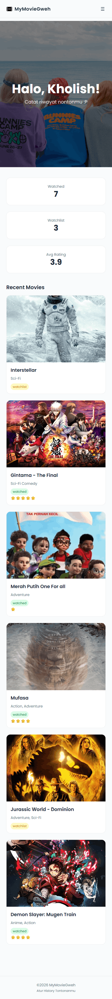
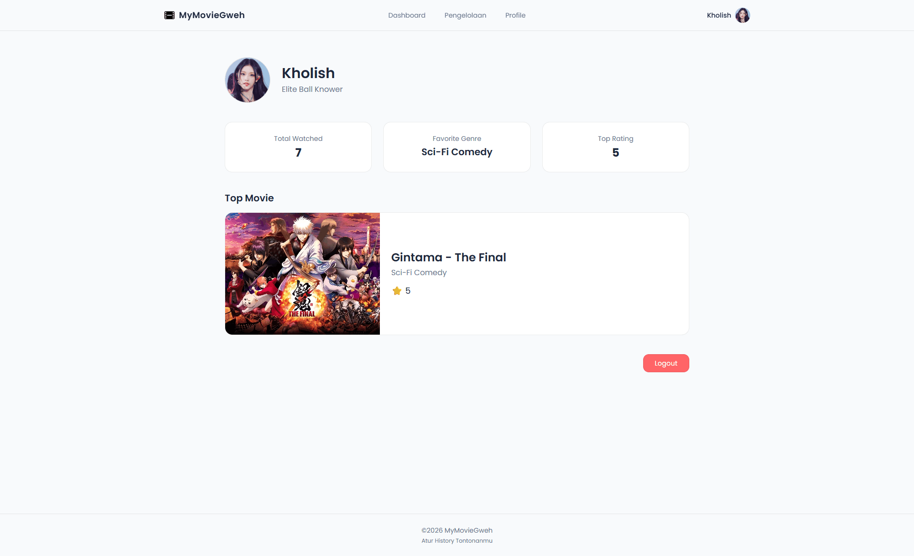
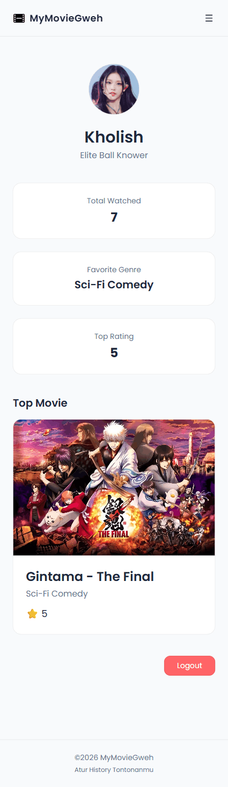
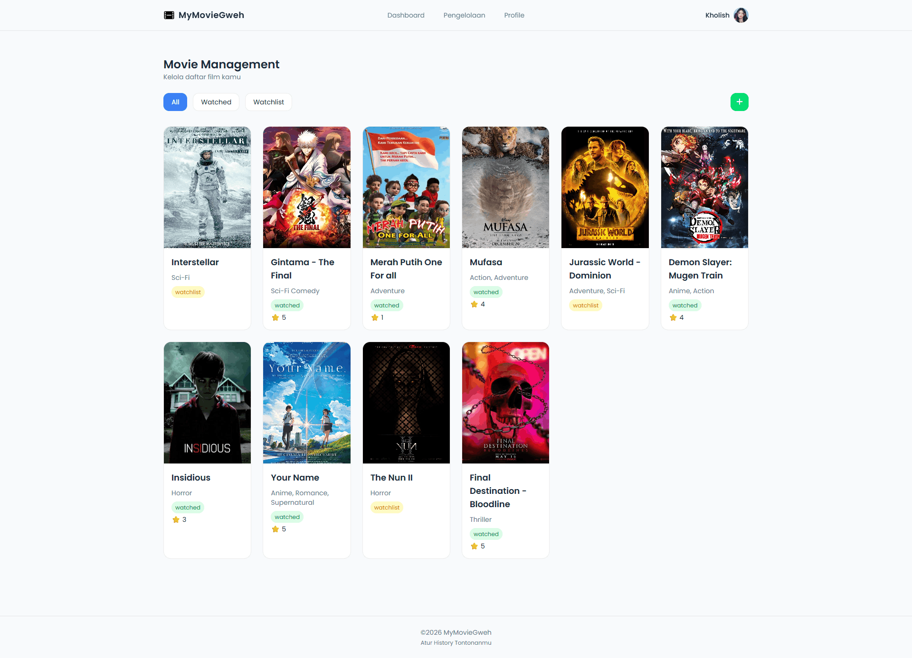
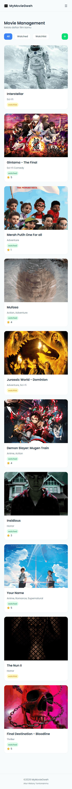

 MyMovieGweh

# Deskripsi

MyMovieGweh adalah sebuah projek yang digunakan untuk memenuhi tugas **UTS Pemrograman berbasis Web**. Tema dari web ini adalah pencatatan film-film secara personal. Di sini, user dapat mencatat dan menyimpan film yang ingin ditonton, menandai film yang sudah ditonton dan melihat statistik mereka.

Berikut adalah alur dari aplikasi ini:

1. Login

- Halaman pertama langsung ditujukan ke halaman login
- User memasukkan username dan password (password hanya pelengkap)
- Sistem menyimpan username ke dalam session
- User diarahkan ke halaman Dashboard

2. Dashboard

- Di dalam sini terdapat navigasi, username, dan konten awal
- Konten berisi beberapa film yang baru baru ini ditambahkan
- Ada ringkasan statistik film juga

3. Profile

- Sistem menampilkan informasi user:
    - Username
    - Top Movie (diambil dari film rating tertinggi)
    - Ringkasan aktivitas (jumlah, film favorit dll)
- Tombol logout di bagian bawah

4. Pengelolaan

- Menampilkan daftar film dari array di controller
- Data ditampilkan menggunakan loop (`@foreach`)
- User dapat:
    - Melihat status film (Watched / Watchlist)
    - Filter film (Alpinejs)

- Author: Muchammad Nur Kholish

---

# Screenshot

## Halaman Login

  
  

---

## Dashboard

  
  

---

## Profile

  
  

---

## Pengelolaan

  
  

---
